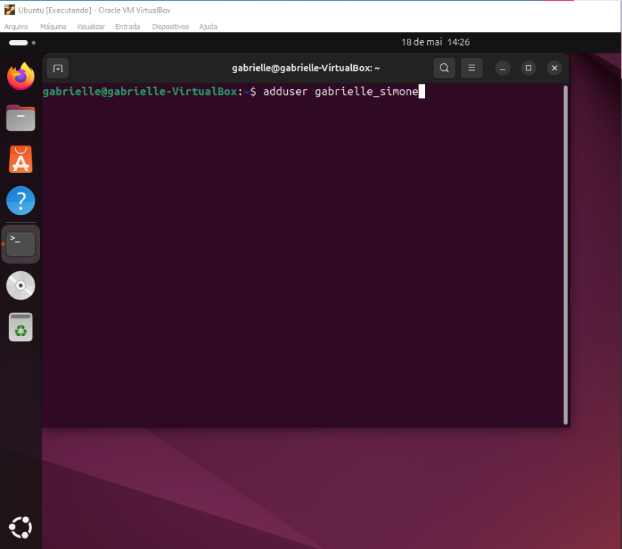
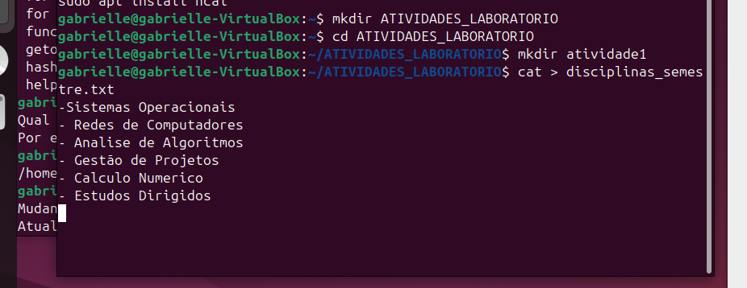

# 🐧 Linux System Administration — Ubuntu + VirtualBox

Prática de **administração de sistemas Linux** utilizando Ubuntu em ambiente virtualizado com Oracle VM VirtualBox. O projeto documenta a configuração da máquina virtual, exploração da hierarquia de diretórios e execução de comandos essenciais.

Projeto desenvolvido como atividade prática da disciplina de **Sistemas Operacionais** no curso de Tecnólogo em Análise e Desenvolvimento de Sistemas.

---

## 📸 Screenshots

**Terminal Ubuntu em execução**



**Histórico de comandos executados**



---

## ✨ Atividades Realizadas

- Instalação e configuração do **Oracle VM VirtualBox**
- Criação e configuração de uma **máquina virtual Ubuntu**
- Exploração da **hierarquia de diretórios** do Linux
- Criação de usuários com `adduser` e gerenciamento de senhas com `passwd`
- Navegação e criação de diretórios com `mkdir`, `cd`, `pwd`, `ls`
- Verificação de usuários ativos com `who`
- Geração de **relatório com histórico de comandos** (`history`)

---

## 🖥️ Comandos Praticados

```bash
# Criar usuário
adduser nome_usuario

# Alterar senha
passwd nome_usuario

# Verificar diretório atual
pwd

# Listar arquivos e diretórios
ls -la

# Criar diretórios
mkdir nome_pasta

# Navegar entre diretórios
cd /caminho/da/pasta

# Verificar usuários logados
who

# Ver histórico de comandos
history

# Ajuda de comandos
help
```

---

## 🗂️ Estrutura de Diretórios Linux

```
/
├── home/       → diretórios dos usuários
├── etc/        → arquivos de configuração do sistema
├── var/        → dados variáveis (logs, caches)
├── usr/        → programas e bibliotecas do sistema
├── bin/        → executáveis essenciais
├── tmp/        → arquivos temporários
└── root/       → diretório do superusuário
```

---

## 🛠️ Tecnologias


---

## 👩‍💻 Autora

**Gabrielle Simone Cunha**

[](https://github.com/gabriellesca)
[](https://linkedin.com/in/gabrielle-simone-928062392)
[](https://gabriellesca.github.io/meu-portfolio)
